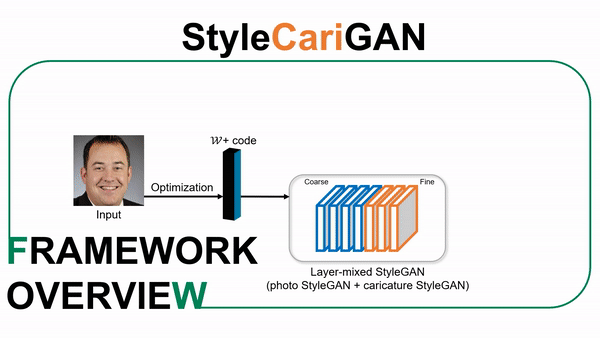
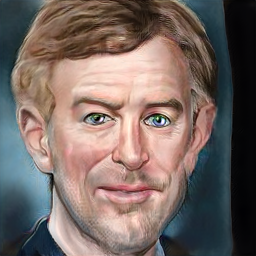
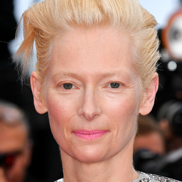
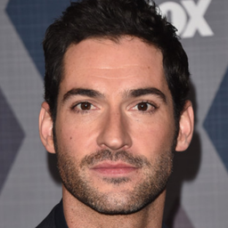

# StyleCariGAN: Caricature Generation via StyleGAN Feature Map Modulation
 <a href="https://replicate.ai/wonjongg/stylecarigan"></a>

[](https://youtu.be/kpHbGOlI-BU)

📝 This repository contains the official PyTorch implementation of the following paper:

> **[StyleCariGAN: Caricature Generation via StyleGAN Feature Map Modulation](https://arxiv.org/abs/2107.04331)**<br>
> Wonjong Jang, Gwangjin Ju, Yucheol Jung, Jiaolong Yang, Xin Tong, Seungyong Lee, SIGGRAPH 2021

🚀 >> [Project page](https://wonjongg.github.io/StyleCariGAN)  
🚀 >> [Fast-forward video](https://youtu.be/kpHbGOlI-BU)

## Overview
<div align="center">
  


</div>

<details>
<summary><b>Explanation</b></summary>
<div markdown="1">
The key component of our method is <b>shape exaggeration blocks</b> that are used for modulating coarse layer feature maps of StyleGAN to produce desirable caricature shape exaggerations.  We first build a layer-mixed StyleGAN for photo-to-caricature style conversion by swapping fine layers of the StyleGAN for photos to the corresponding layers of the StyleGAN trained to generate caricatures. Given an input photo, the layer-mixed model produces detailed color stylization for a caricature but without shape exaggerations. We then append shape exaggeration blocks to the coarse layers of the layer-mixed model and train the blocks to create shape exaggerations while preserving the characteristic appearances of the input.
</div>
</details>

## Requirements
✔️ PyTorch 1.3.1  
✔️ torchvision 0.4.2  
✔️ CUDA 10.1/10.2  
✔️ dlib 19.22.0  
✔️ requests 2.23.0  
✔️ tqdm 4.46.2

⚠️ If you are using Anaconda environment and get errors regarding compiler version mismatch, check issue [#1](/../../issues/1).

## Usage

First download pre-trained model weights:

> bash ./download.sh


### Train

> python -m torch.distributed.launch --nproc_per_node=N_GPU train.py --name EXPERIMENT_NAME --freeze_D

### Test


Test on user's input images:

> python test.py --ckpt CHECKPOINT_PATH --input_dir INPUT_IMAGE_PATH --output_dir OUTPUT_CARICATURE_PATH --invert_images

We provide some sample images. Test on sample images:

> python test.py --ckpt CHECKPOINT_PATH --input_dir examples/samples --output_dir examples/results --invert_images

It inverts latent codes from input photos and generates caricatures from latent codes.

## Examples
<div align="center">
  
|Input image|Output caricature|
|:-:|:-:|
|||
|||
|||
|||

</div>

## Citation
If you find this code useful, please consider citing:
```
@article{Jang2021StyleCari,
  author    = {Wonjong Jang and Gwangjin Ju and Yucheol Jung and Jiaolong Yang and Xin Tong and Seungyong Lee},
  title     = {StyleCariGAN: Caricature Generation via StyleGAN Feature Map Modulation},
  booktitle = {ACM Transactions on Graphics (Proceedings of ACM SIGGRAPH)},
  publisher = {ACM},
  volume = {40},
  number = {4},
  year = {2021}
}
```

## Download pre-trained models

🏷️ [StyleCariGAN](https://drive.google.com/file/d/18UKYtQ46M0inNrgnBzfYub38-uzQHp7Y/view?usp=share_link)  
🏷️ [Photo-StyleGAN (generator_ffhq.pt)](https://drive.google.com/file/d/1rI41-df-kXIcukpRCBEOzVHf374b9AAB/view?usp=share_link)  
🏷️ [Caricature-StyleGAN (generator_cari.pt)](https://drive.google.com/file/d/1H8LUmTStiYB-L5ofbAZwQ6D7WP1By73_/view?usp=share_link)  
🏷️ [Photo-Attribute-Classifier (photo_resnet.pth)](https://drive.google.com/file/d/1DbRDo2ifoLFbJXLAdO7-pJdJkDHCxOFd/view?usp=share_link)  
🏷️ [Cari-Attribute-Classifier (cari_resnet.pth)](https://drive.google.com/file/d/1-AC0BY46foSWss4kjP_F4Vt67lTsTe1j/view?usp=share_link)  


## Contact
📫 You can have contact with [wonjong@postech.ac.kr](mailto:wonjong@postech.ac.kr) or [ycjung@postech.ac.kr](mailto:ycjung@postech.ac.kr)

## License
This software is being made available under the terms in the [LICENSE](LICENSE) file.

Any exemptions to these terms require a license from the Pohang University of Science and Technology.

## Credits
❤️ Our code is based on [the official StyleGAN2 implementation](https://github.com/NVlabs/stylegan2) and [rosinality's StyleGAN2-pytorch code](https://github.com/rosinality/stylegan2-pytorch)  
❤️ Specially thanks to [CJWBW](https://github.com/CJWBW) who ported our project to [Replicate](https://replicate.ai/wonjongg/stylecarigan).
