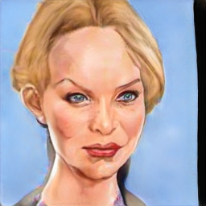

# StyleCariGAN: Caricature Generation via StyleGAN Feature Map Modulation


<p align="center">
   
</p>

This repository contains the official PyTorch implementation of the following paper:

> **[StyleCariGAN: Caricature Generation via StyleGAN Feature Map Modulation](https://arxiv.org/abs/2107.04331)**<br>
> Wonjong Jang, Gwangjin Ju, Yucheol Jung, Jiaolong Yang, Xin Tong, Seungyong Lee, SIGGRAPH 2021

## Requirements

* PyTorch 1.3.1
* CUDA 10.1/10.2
* dlib 19.22.1
* requests 2.23.0

## Usage

First download pre-trained model weights:

> bash ./download.sh


### Train

> python -m torch.distributed.launch --nproc_per_node=N_GPU train.py --name EXPERIMENT_NAME --freeze_D

### Test


Test on user's input images:

> python test.py --ckpt CHECKPOINT_PATH --input_dir INPUT_IMAGE_PATH --output_dir OUTPUT_CARICATURE_PATH --invert_images

We provide some sample images. Test on sample images:

> python test.py --ckpt CHECKPOINT_PATH --input_dir examples/samples --output_dir examples/results --invert_images

It inverts latent codes from input photos and generates caricatures from latent codes.

|Input image|Output caricature|
|:-:|:-:|
|||


### Citation
If you find this code useful, please consider citing:
```
@article{Jang2021StyleCari,
  author    = {Wonjong Jang and Gwangjin Ju and Yucheol Jung and Jiaolong Yang and Xin Tong and Seungyong Lee},
  title     = {StyleCariGAN: Caricature Generation via StyleGAN Feature Map Modulation},
  booktitle = {ACM Transactions on Graphics (Proceedings of ACM SIGGRAPH)},
  publisher = {ACM},
  volume = {40},
  number = {4},
  year = {2021}
}
```


### Contact
You can have contact with [wonjong@postech.ac.kr](mailto:wonjong@postech.ac.kr) or [ycjung@postech.ac.kr](mailto:ycjung@postech.ac.kr)


### License
This software is being made available under the terms in the [LICENSE](LICENSE) file.

Any exemptions to these terms requrie a licens from the Pohang University of Science and Technology.


